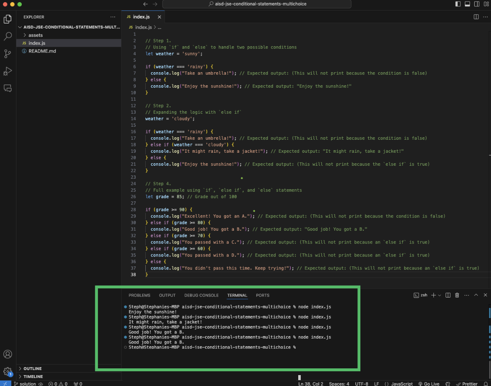
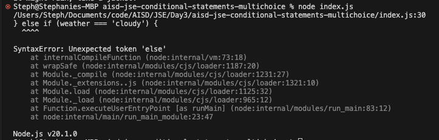

# JavaScript Basics: Multi-Choice Conditional Statements



## Description 📄

In this project, you'll expand your knowledge of JavaScript conditional statements by learning how to use the `else if` structure. This will allow you to handle multiple conditions in your code, giving your program the ability to make more complex decisions. You'll learn that only one block is executed when a condition is met and how to use the `else` statement as a catch-all for any cases not covered by previous conditions.

## Expected Project Structure 🏗️

```
ConditionalStatementsExpanded/
└── index.js
```

# Instructions ✅

## 1. **Create the Project Folder and File**

- [ ] If you haven't already, create a folder named `ConditionalStatementsExpanded` to store your project files.
- [ ] Inside the `ConditionalStatementsExpanded` folder, create or open the file named `index.js`. This file will contain all your JavaScript code.

## 2. **Expand Conditional Logic with `else if`**

Start by setting up a basic conditional statement using `if` and `else`. This will allow you to execute different blocks of code based on whether a condition is `true` or `false`.

- [ ] In your `index.js` file, add the following code to create a simple `if` and `else` statement:

```js
// Using `if` and `else` to handle two possible conditions
let weather = 'sunny';

if (weather === 'rainy') {
  console.log("Take an umbrella!"); // Expected output: (This will not print because the condition is false)
} else {
  console.log("Enjoy the sunshine!"); // Expected output: "Enjoy the sunshine!"
}
```

- [ ] See your code in action: Run the JavaScript file in your terminal by entering the command `node index.js` and pressing Enter.


**Explanation:**

- The `if` statement checks if the variable weather is equal to `'rainy'`. If it is, the code inside the `if` block will execute.
- If the `if` condition is `false` (as in this case where `weather` is `'sunny'`), the else block will execute, printing "Enjoy the sunshine!" to the console.


## 3. **Expand Conditional Logic with `else if`**

Now, let's enhance the conditional logic by adding an `else if` statement. This allows your program to check multiple conditions in sequence after the initial `if` condition.

- [ ] In your `index.js` file, change the value of the `weather` variable to `"cloudy"`. Do this by creating a new line that reassigns the variable, rather than modifying the original line where it is declared.
- [ ] Update your code to expand your example with an `else if` statement:

```js
// Expanding the logic with `else if`
weather = 'cloudy';

if (weather === 'rainy') {
  console.log("Take an umbrella!"); // Expected output: (This will not print because the condition is false)
} else if (weather === 'cloudy') {
  console.log("It might rain, take a jacket!"); // Expected output: "It might rain, take a jacket!"
} else {
  console.log("Enjoy the sunshine!"); // Expected output: (This will not print because the `else if` is true)
}
```

- [ ] See your code in action: Run the JavaScript file in your terminal by entering the command `node index.js` and pressing Enter.

**Explanation:**

- The `if` statement checks if `weather` is `'rainy'`. If it is, it prints "Take an umbrella!".
- The `else if` statement checks if `weather` is `'cloudy'`. If this condition is `true` and the first `if` is `false`, it prints "It might rain, take a jacket!".
- If neither the `if` nor the `else if` conditions are `true`, the `else` block will execute, printing "Enjoy the sunshine!".

## 4. **Understand Why Order Matters**
Conditions are evaluated in order from top to bottom. Once a `true` condition is found, its block is executed, and the rest are skipped. 

- [ ] In your `index.js` file, switch the order of the `else` and `else if` statements:

```js
// Order Matters: Switching else and else if statements
weather = 'cloudy';

if (weather === 'rainy') {
  console.log("Take an umbrella!"); // Expected output: (This will not print because the condition is false)
} else {
  console.log("Enjoy the sunshine!"); // Expected output: "Enjoy the sunshine!"
} else if (weather === 'cloudy') {
  console.log("It might rain, take a jacket!"); // Expected output: SyntaxError: Unexpected token 'else'
}
```

- [ ] See your code in action: Run the JavaScript file in your terminal by entering the command `node index.js` and pressing Enter.


- [ ] Observe the "`Unexpected token 'else'`" error in the console.

**Explanation:**

- This error occurs because the `else` statement must be the final condition in a series of `if` and `else if` statements. In the example, `else` comes before `else if`, which is not allowed in JavaScript syntax.
- JavaScript expects `else` to handle all remaining cases, so it cannot be followed by another condition like `else if`.
- To fix the error, place the `else` statement last, after all `else if` conditions. This ensures the code runs correctly and checks each condition in order.


## 5. **Create a Comprehensive Example with `if`, `else if`, and `else`**

Combine all the concepts to create a complete example using all three components: `if`, `else if`, and `else`.

- [ ] In your `index.js` file, add the following code to create a new example that builds on what you've learned about `if`, `else if` and `else` conditional statements:

```js
// Full example using `if`, `else if`, and `else` statements
let grade = 85; // Grade out of 100

if (grade >= 90) {
  console.log("Excellent! You got an A."); // Expected output: (This will not print because the condition is false)
} else if (grade >= 80) {
  console.log("Good job! You got a B."); // Expected output: "Good job! You got a B."
} else if (grade >= 70) {
  console.log("You passed with a C."); // Expected output: (This will not print because an `else if` is true)
} else if (grade >= 60) {
  console.log("You passed with a D."); // Expected output: (This will not print because an `else if` is true)
} else {
  console.log("You didn't pass this time. Keep trying!"); // Expected output: (This will not print because an `else if` is true)
}
```

- [ ] Run your JavaScript file in the terminal by entering `node index.js` and pressing Enter.

**Explanation:**

- The `if` block checks if `grade` is 90 or higher. If it is, the program prints "Excellent! You got an A."
- The first `else if` block checks if `grade` is 80 or higher but less than 90. If this condition is `true`, it prints "Good job! You got a B."
- The second `else if` block checks if `grade` is 70 or higher but less than 80. If this condition is `true`, it prints "You passed with a C."
- The third `else if` block checks if `grade` is 60 or higher but less than 70. If this condition is `true`, it prints "You passed with a D."
- The `else` block executes if none of the previous conditions are `true`, printing "Better luck next time. You failed."


## 6. **Practice Writing Your Own Multi-Choice Conditions**

- [ ] Write your own examples using `if`, `else if`, and `else` to handle multiple conditions. Try experimenting with different scenarios, such as determining discount rates based on customer age or determining movie ticket prices based on age.

## 7. **Commit and Push to Github**

- [ ] Commit and push your work to Github.

##

# Conclusion 📄

In this activity, you learned how to use the `else if` structure to handle multiple conditions in JavaScript. Understanding the order of conditions, knowing that only one block executes, and using `else` as a catch-all are essential skills for writing flexible and dynamic code.

##

### Solution codebase 👀
🛑 **Only use this as a reference** 🛑

💾 **Not something to copy and paste** 💾

**Note:** This lab references a solution file located [here](https://github.com/HackerUSA-CE/aisd-jse-conditional-statements-multichoice/tree/solution) (link not shown).

---

© All rights reserved to ThriveDX
